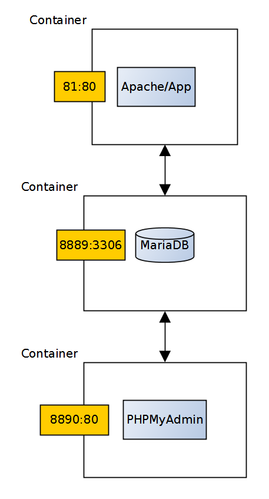
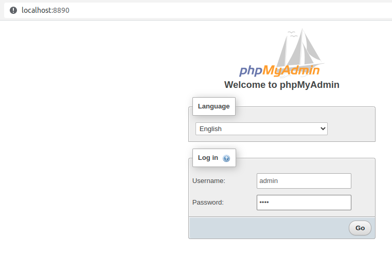
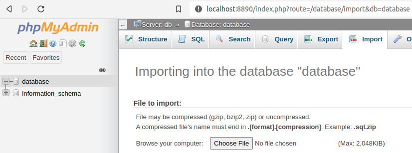
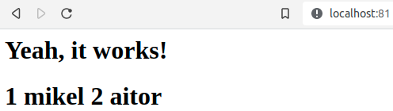

# Laborategia: Docker

## Beharrezkoa

- Kode-editorea. Visual Studio Code-n, `ctrl+mayus+v` sakatuta fitxategi hau modu erosoan ikusten da (batez ere irudietarako).
- GNU/Linux makina: eramangarria, makina birtuala, edo laborategiko PCa (LDAP kredentzialarekin sartu).
- Docker fitxategiak.
- GitHub-en eskuragarri dagoen oinarrizko docker-compose proiektua.

## 1. Sarrera

[Docker](https://www.docker.com/) GNU/Linux-erako birtualizazio azpiegitura bat da, edukiontzietan oinarritua. VirtualBox bezalako beste birtualizazio tresna batzuekin alderatuta, Docker motorrak tarteko geruza bat eskaintzen du edukiontzien eta sistema eragilearen artean; horrela, ez da sistema eragile "osoa" birtualizatu behar, eta edukiontziak askoz arinagoak dira. Oso tresna ezaguna da, jatorrizko inguruneari leialak diren zerbitzuen hedapenak egiteko erabiltzen dena, "nire lokalean ondo dabil" klasikoa saihestuz (baina bezeroaren ingurunean ez).

Dockerren elementu nagusia irudia da: zerbitzuak funtzionatzeko behar duen guztia duen fitxategi konprimitu aldaezina (sistema, bitarrak, liburutegiak, fitxategiak, etab.). Irudi batetik edukiontziak sor daitezke, zerbitzuaren exekuzio isolatu, efimero eta aldagarriak direnak.

Dockerrek irudi-biltegiak sortzeko aukera ere eskaintzen du: biltegi ofizialak berrerabili daitezkeen irudi ofizialak ditu, zerbitzu espezifikoak eraikitzeko.

## 2. Instalazioa eta konfigurazioa

Docker instalatzeko:

```bash
sudo apt install docker.io
```

Dockerrek `root` pribilegioak behar ditu. `sudo` erabili behar ez izateko:

- Docker taldea sortu:

```bash
sudo groupadd docker
```

- Uneko erabiltzailea `docker` taldera gehitu:

```bash
sudo usermod -aG docker $USER
```

- Sistema berrabiarazi, berriro sartu, eta exekutatu:

```bash
docker run hello-world
```


## 3. Irudiak kudeatu

Dockerrek biltegi lokal bat dauka, gure ordenagailuan erabiliko ditugun irudiekin.

- Zure biltegi lokalean dauden irudiak ikusteko:

```bash
docker images
```

Biltegi urrun arruntena Docker Hub da, Docker instalatzean lehenespenez konfiguratuta dagoen biltegia.

- Aztertu Docker Hub-en aurki daitezkeen irudiak.

Irudi bat biltegi urrunetik biltegi lokalera deskargatuko dugu:

- Bilatu `hello-world` irudia Docker Hub-en.
- Deskargatu irudia biltegi lokalera:

```bash
docker pull hello-world
```

Galdera:

- Zein komandorekin igotzen dira irudiak Docker Hub-era gure biltegi lokaletik?

## 4. Edukiontziak exekutatu

Dockerren, edukiontziak irudi batetik abiatuta exekutatzen dira.

- Exekutatu edukiontzi bat `hello-world` iruditik:

```bash
docker run hello-world
```

Galdera:

- Zer output ematen du edukiontziaren exekuzioak?

- Exekutatu:

```bash
docker run -it ubuntu bash
```

Galderak:

- Nondik ateratzen da `ubuntu` irudia?
- Zer alde dago `docker run` eta `docker run -it` artean?
- Zergatik aldatu da terminaleko prompt-a?
- `ls` bidez zerrenda bat egiten badugu, zein makinari dagozkio karpetak?
- Zer output ematen du `docker ps -a` komandoak?

Edukiontziak gelditzeko, haien izena edo identifikatzailea behar dugu:

```bash
docker kill izena_edo_id
docker ps -a
```

Edukiontziak martxan ez egon arren, ezabatu egin behar dira:

```bash
docker rm izena_edo_id
docker ps -a
docker images
```

Galderak:

- Zer alde dago edukiontzi bat gelditzearen eta ezabatzearen artean?
- Nola eragiten dio edukiontzia sortu den irudiari?
- Nola ezabatzen da irudi bat?

Exekutatu berriro edukiontzi bat `ubuntu` iruditik:

```bash
docker run -it ubuntu bash
```

Beste terminal batean:

```bash
docker exec edukiontzi_izena ls
```

Galdera:

- Zer alde dago `run` eta `exec` artean?

## 5. Irudiak eraiki

Docker irudi bat eraikitzeko Dockerfile bat behar dugu. Dockerfile hori testu arrunteko fitxategi bat da, Dockeri irudia nola eraiki behar duen adierazten diona.

Adibidez:

- `FROM`: erabiliko den oinarrizko irudia.
- `ADD`: fitxategi lokalak irudira gehitzen ditu.
- `RUN`: komandoak exekutatzen ditu.
- `CMD`: Dockerfile-an deskribatutako iruditik edukiontzia abiaraztean exekutatuko den komandoa.


Galdera:

- Irudi honetatik edukiontzi bat exekutatzen dugunean, zer output lortuko dugu? Zergatik?

Biltegi honetako [Dockerfile-a](Dockerfile) erabilita irudi bat eraikiko dugu:

- Exekutatu direktorio berean (izena edozein izan daiteke):

```bash
docker build -t="izena" .
```

- Egiaztatu irudia eraiki dela eta biltegi lokalera gehitu dela:

```bash
docker images
```

- Exekutatu oraintxe eraiki dugun irudiaren edukiontzi bat:

```bash
docker run izena
```

Galderak:

- Zer output ematen du edukiontzia exekutatzean?
- Nola aldatuko zenuke lortzen den mezua?

Dockerrek host-aren eta edukiontziaren artean partekatutako karpetak muntatzeko aukera ematen digu; hau da, biek irakurri eta idatz dezakete direktorio horietan.

Probatzeko:

- Sortu `dir-msg` izeneko karpeta, barruan "iep" katea duen `msg2` fitxategiarekin:

```bash
mkdir dir-msg && echo "iep" > dir-msg/msg2
```

- Exekutatu `ubuntu` irudiko edukiontzi bat modu interaktiboan, `dir-msg` karpeta edukiontziaren barruan `/app` karpeta muntatuz:

```bash
docker run -it -v "$(pwd)"/dir-msg:/app ubuntu bash
```

- Edukiontziaren barruan zaudenean, egiaztatu ondo muntatu dela:

```bash
cat /app/msg2
```

- Beste terminal batean, aldatu `dir-msg/msg2`-ren edukia eta berriro exekutatu `cat /app/msg2` edukiontziaren barruan.

Galderak:

- Fitxategiaren edukia aldatu da?
- Zergatik?

Edukiontziak, definizioz, efimeroak dira. Horregatik, Dockerren bolumenak oso garrantzitsuak dira; bestela edukiontzia ezabatzean galduko liratekeen datuak iraunkortzeko aukera ematen dute (malkoak euritan bezala).

Docker bidez hedatuko diren aplikazioak garatzean, oso ohikoa da honela lan egitea:

1. Garapen-karpeta aplikazioarekin eta datuen karpeta edukiontzian muntatu.
2. Garatu eta probak egin.
3. Aplikazioaren bertsio egonkorra lortzen dugunean, Dockerfile-era gehitu.

## 6. Zerbitzuak exekutatu

docker-compose erabilita, aldi berean eta modu koordinatuan exekutatuko den zerbitzu multzo bat defini dezakegu, zerbitzu bakoitza Docker irudi batean oinarrituta. Kontuan hartuta gaur egun aplikazio asko zerbitzu-konbinazioetan oinarritzen direla (datu-basea, web zerbitzaria, beste zerbitzari batzuk, etab.), hau oso ezaugarri garrantzitsua da.

Ikus dezagun docker-compose nola dabilen, [jada existitzen den proiektu bat](https://github.com/mikel-egana-aranguren/docker-lamp) aztertuz. Proiektuak web aplikazio sinplea osatzen duten hiru zerbitzu ditu:

- PHP aplikazio bat duen web zerbitzari bat (web aplikazioa bera), MariaDB datu-base batera sartzen dena.
- MariaDB datu-basea.
- MariaDB datu-basea kudeatzeko PHPMyAdmin aplikazioa duen web zerbitzari bat.

Klonatu proiektua duen GitHub biltegia:

```bash
git clone https://github.com/mikel-egana-aranguren/docker-lamp.git
```

`docker-lamp/docker-compose.yml` fitxategiak zerbitzuen definizioa dauka. Kasu honetan hiru zerbitzu daude (zerbitzuaren izena eta oinarritzen den Docker irudiaren izena desberdinak izan daitezke):

- `web`: zerbitzu hau Dockerfile-tik eraikitako web irudian oinarritzen da; Apache web zerbitzaria eta `/app`-en definitutako PHP aplikazio bat ditu (irudi hau PHPren irudi ofizialaren hedapen bat da). `db` zerbitzuarekin lotzen da eta host-aren 81 portua edukiontziaren 80 portura birbideratzen du (Apache han exekutatzen da).
- `db`: `mariadb` irudia MariaDB datu-basea eskaintzen duen irudi ofiziala da. Kasu honetan zerbitzua `./mysql` bolumeneko datuak hartuta exekutatzen da (hau da, edukiontzi bat berriro exekutatzen badugu, datuak karpeta horretatik kargatuko dira eta ez dira galduko, edukiontzia desagertu bada ere), `environment` ataleko konfigurazioarekin eta host-aren 8889 portua edukiontziaren 3306 portura birbideratuz.
- `phpmyadmin`: zerbitzu hau PHPMyAdminen irudi ofizialean oinarritzen da, `db` zerbitzuarekin konektatzen da eta datu-basea administratzeko erabiltzen da, hostaren 8890 portua edukiontziaren 80 portura birbideratuz.




Proiektua hedatzeko:

- Jarri terminala `docker-lamp` biltegiaren barruan.
- Eraiki `web` irudia:

```bash
docker build -t="web" .
```

- Hedatu zerbitzuak honela:

```bash
docker-compose up
```

- Bisitatu weba hemen: http://localhost:81
- Behar diren datuak gehitzeko, bisitatu http://localhost:8890/ (guk `docker-compose.yml`-n definitu dugun bezala, erabiltzailea "admin", pasahitza "test").
- Egin klik `database`-n eta gero `import` aukeran; han `docker-lamp/database.sql` fitxategia hautatzen da.
- Itzuli http://localhost:81 helbidera; informazio gehiago agertu beharko litzateke.






Zerbitzuak gelditzeko, `ctrl+c` edo ireki beste terminal bat karpeta berean eta:

```bash
docker-compose down
```
