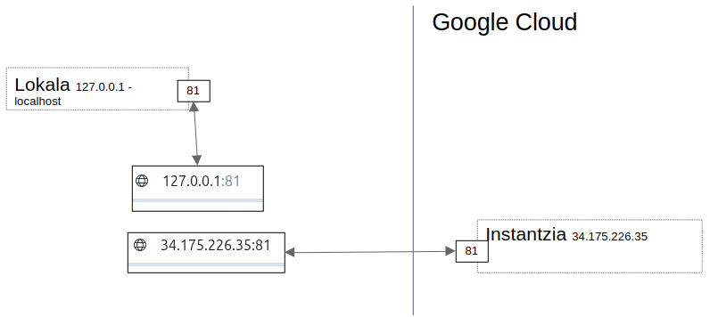
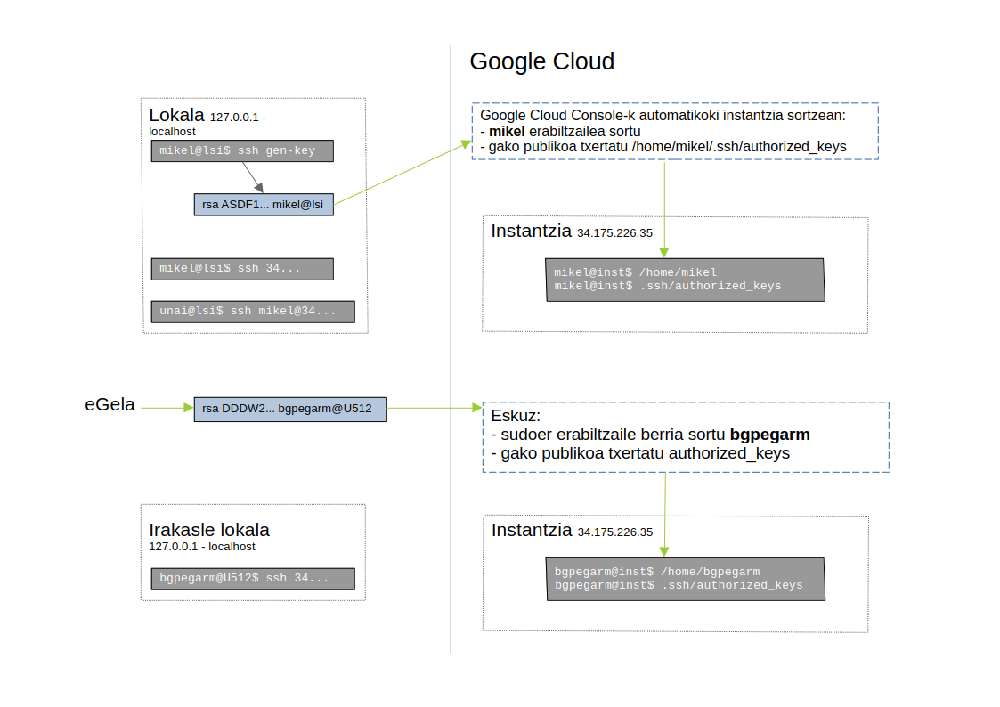
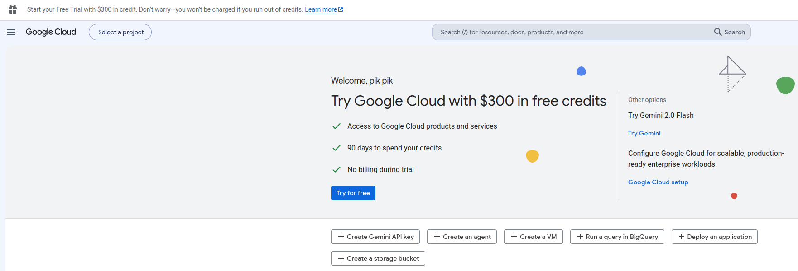
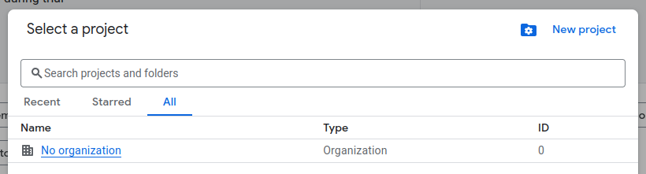
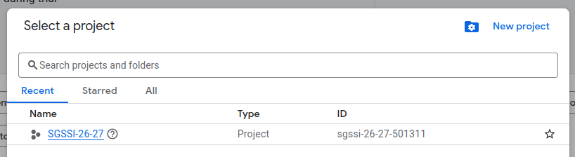
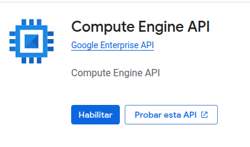
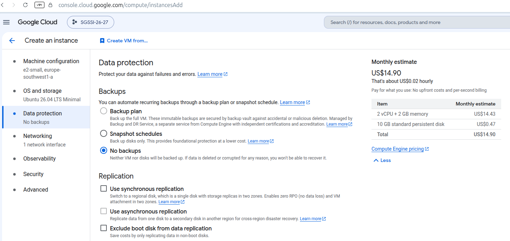
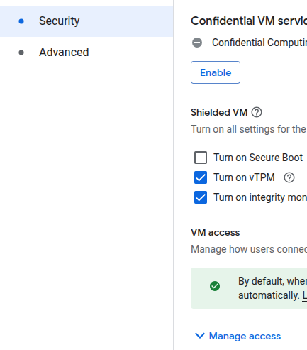
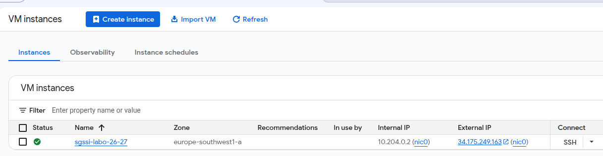

# Laborategia: Google Cloudeko urruneko zerbitzaria

## Beharrezkoa

- Kode-editorea. Visual Studio Code-n, `ctrl+mayus+v` sakatuta fitxategi hau modu erosoan bistaratzen da (batez ere irudietarako).
- Bi posta-kontu:
  - Unibertsitateko posta (@ehu.eus, @ikasle.ehu.eus), Google Cloud kredituak lortzeko.
  - Gmail kontu berri bat (adibidez, nire_izena_issks_26_27@gmail.com), ikasturtean zehar Google Cloud zerbitzua erabiltzeko.
- SSH gako publiko/pribatu bikotea (GitHuberako bera erabil daiteke edo berri bat sortu).

## Sarrera

[Google Cloud](https://cloud.google.com/) Googlek eskaintzen duen hodeiko konputazio plataforma da. [Hezkuntzarako](https://cloud.google.com/billing/docs/how-to/edu-grants) kreditu doakoak eskaintzen ditu; kreditu horiek erabiliko ditugu zerbitzari bat sortu eta harekin lan egiteko, SSH bidez konektatuz.





## Kreditua lortu eta proiektu bat sortu

Ikasturterako sortutako kontuaren Gmail-era sartu (**GARRANTZITSUA**: ez da egon behar beste Gmail kontu batekin irekita dagoen beste fitxarik). Beste fitxa berri batean, sartu [Google Cloud Console](https://console.cloud.google.com) atarian:



(**GARRANTZITSUA**: ez sakatu 300$-eko kredituen gainean).

Sakatu `Select a project` eta gero `New project`:



Sortu proiektu bat, adibidez "ISSKS-26-27", eta hautatu; sakatu `Select a project` eta gero `ISSKS-26-27`:



Ireki beste fitxa bat eta itsatsi eGelan dagoen URLa, `Google Cloud kredituak` atalean (`Oinarrizko laborategiak` atalaren azpian); honelako orri bat agertu beharko litzateke:


Bertan izena-abizenak eta EHUko posta-helbidea sartu (ez Gmail, ez beste edozein). **GARRANTZITSUA**: `Submit` sakatu ondoren, ez berriro sakatu; denbora pixka bat behar izan dezake. EHUko postan hurrengo urratsekin baieztapena jasoko duzu. Kredituak lortutakoan, `Google Cloud`; menu burger (hiru lerro); `Billing`; `Credits` atalean honelako zerbait agertu beharko litzateke (ziurrenik 100 beharrean 50ekin):


**GARRANTZITSUA**: baliteke sortutako proiektua eskuratu berri den kreditu-kontuarekin lotu behar izatea.

## Zerbitzaria sortu

Behin orri nagusian zaudela, sakatu `Compute Engine` eta gero `Instancias de VM` (beharrezkoa bada, gaitu Compute Engine API).



Sakatu `Create instance` eta honen antzeko pantaila bat agertuko da:


Aukera garrantzitsuak:

- Izena: edozein, baina erraz identifikatzeko modukoa; adibidez, “issks-labo”.
- Aukeratu Europa barruko eskualde bat.
- Erabilera orokorrekoa.
- Seriea: E2.
- Makina mota: e2-small.

Joan `OS and storage` atalera:


Aukeratu `Ubuntu 26.04 LTS Minimal` eta `Standard persistent disk`.

Joan `Data protection` atalera eta aukeratu `No backup`:



Joan `Networking` atalera eta aktibatu HTTP, HTTPS eta karga-orekatzaileko trafikoa:


`Networking` barruan, sakatu `Default` `Network interfaces` atalean:


Sakatu `External IPv4 address - Ephemeral` eta gero `Reserve static external IP address`, IP estatiko bat erreserbatzeko:


`Security` atalean, sakatu `Manage access`:



Sakatu `Add manually generated SSH keys - add item` eta itsatsi SSH gako publikoa (ordenagailu lokaletik kopiatu `cat` erabiliz):


**GARRANTZITSUA**: Google Cloudek instantzian erabiltzaile berri bat sortzen du, gako publikoko erabiltzaile-izen berarekin, `ssh./authorized_keys` fitxategiarekin.

Sortu instantzia aipatutako aukera guztiekin. Une batzuk igaro ondoren, honela agertu beharko litzateke:



## SSH sarbidea

Sarbidea ziurtatzeko, egin SSH konexioa ordenagailu lokaletik kanpoko IPra, terminal lokalean (Google Cloud web interfazeko SSH botoia erabili gabe):

```bash
$ ssh KANPO_IP_GOOGLE_CLOUD
```
**GARRANTZITSUA**: SSHk erabiltzailerik gabe funtzionatzen du, baldin eta gehitutako erabiltzailea uneko terminaleko bera bada.

`.ssh/authorized_keys` fitxategia begiratzean, zuen gako publikoa agertuko da, Googlek gehituta.

Irakasleari sarbidea emateko, sortu `bgpegarm` erabiltzailea, `sudoer` taldean eta eGelan dagoen pasahitzarekin. Gehitu eGelan eskuragarri dagoen irakaslearen gako publikoa erabiltzaile horren `home` direktorioan, `.ssh/authorized_keys` fitxategian. Bidali kanpoko IPa (IPa bakarrik, testu lau gisa) eGelako entregan, irakasleak konekta daitekeela egiaztatzeko.

**GARRANTZITSUA**: azterketan ezin da ordenagailu eramangarri pribatua erabili, eta laborategiko edozein ordenagailu erabiliko da; beraz, azterketan ikaslea gai izan behar da SSH gako berriak sortzeko edo gordetako SSH gakoak berrerabiltzeko.

**GARRANTZITSUA**: instantzia erabilera bakoitzaren ondoren itzali. Ikasle bakoitzaren ardura da azterketarako nahikoa Google Cloud kreditu izatea.
