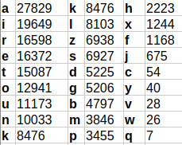

# Laborategia: Zifraketa simetrikoa

## Aurreko baldintzak

- GNU/Linux makina: eramangarria, makina birtuala edo laborategiko PCa (Sartu LDAP kredentzialekin).
- Kode editorea. Visual Studio Code-n, ctrl+maius+v sakatuz fitxategi hau errazago ikusten da (batez ere irudietarako).
- Beharrezko tresnak: OpenSSL (`sudo apt install openssl`).
- Irakasgaiaren GitHub biltegia: laborategian garatutako programak igo ditzakezu.

## Indar erasoa Cesar-en zifraketaren aurka

Sortu hurrengo mezua indar-eraso bidez deszifratzeko programa, edozein hizkuntzatan: "Uunejvxb dw vdwmx wdnex jzdr, nw wdnbcaxb lxajixwnb". Hots, programak gakoa inferitu behar du eta berau erabili mezua deszifratzeko (KONTUAN HARTU: hizkuntza autodetekzioa Python-en, mezua gazteleraz dago).

## Indar erasoa ordezkapen sinpleko zifraketaren aurka

Sortu indar-eraso bidez aurreko mezua deszifratzen duen programa (Edozein hizkuntzatan):

JIYQ WQIEtYLP YtXLLW OPLP! CWXYM SPMQPLtP YEYQWtP CPOX PLZP SBPJPQX bPBQXWYtPQX bPtYPM. JYLYM bPW, XLPWM HYMCY PEQX PtYLPtJYM CP HPWJQWbYB WQIEtYLP; tRPBXPQ YtP tRPBXPQ, YtP «PISP, HPWJQWbYB!» XWFIPQ WJPM CWLP MPOIEW WbWBbWCY XEXPM. QPBY MPOIEWP YLY HPCP YJ CP BYFYM bYJPWM OPtPJQPtEIP, bPWMP, XLPWMCWQ YLY, JYMbPWt YZPQIZY OPJtYQ SPEPYLPM bWJQPLLP YZPM CWXtY HPWJQWbYBW, SPLtY FPLtJYP bPWZYMtJYM CWYM QXMSPWMWP bPQPLLPLW.

Mezua euskaraz dago eta maiztasunen analisia erabili beharko duzu ondorengo taularen bidez:



(KONTUAN HARTU: programa interaktiboa izan daiteke).

## XOR bidezko fluxu zifraketa

Inplementatu programa bat, mezuak zifratzen eta deskodetzen dituen fluxu-zifraketa sinple baten bidez. Programak honako hau egin behar du:

- Irakurri mezua eta luzera bereko gakoa, byte kate gisa irudikatuta.
- Aplikatu XOR eragiketa byte bakoitzeko mezua eta gakoa bitartez, kriptograma lortzeko.
- Erabili berdin XOR eragiketa jatorrizko mezua berreskuratzeko kriptogramatik.
- Erakutsi jatorrizko mezua, gakoa eta kriptograma hexadezimalean.
- Egiaztatu kriptogramaren deskodetzeak zehazki jatorrizko mezua sortzen duela.

Erabili ondorengo datu probak:

- Mezua: `GURE MEZUA HAU DA`
- Gakoa: `GAKO1234567890`

## OpenSSL erabiliz zifratzea eta deskodetzea

Erabili `openssl enc` tresna Ubuntu terminalan AES, Triple DES eta DES erabiliz fitxategi bat zifratzeko eta deskodetzeko. Ez duzu programarik inplementatu behar.

Prestatu mezua eta pasahitza fitxategi bereizi batean:

```bash
printf '%s\n' 'Kriptografiak konfidentzialtasuna bermatzen du' > mezua.txt
printf '%s\n' 'Laborategi2026' > gako.txt
```

Zifratu eta deskodetu mezua AES-256-CBC erabiliz:

```bash
openssl enc -aes-256-cbc -pbkdf2 -iter 100000 -salt \
	-in mezua.txt -out mezua.aes -pass file:gako.txt
openssl enc -d -aes-256-cbc -pbkdf2 -iter 100000 \
	-in mezua.aes -out mezua.aes.deszifratua -pass file:gako.txt
cmp mezua.txt mezua.aes.deszifratua
```

Errepikatu Triple DES eta DES-ekin:

```bash
openssl enc -des-ede3-cbc -provider default -provider legacy -pbkdf2 \
	-iter 100000 -salt -in mezua.txt -out mezua.3des \
	-pass file:gako.txt
openssl enc -d -des-ede3-cbc -provider default -provider legacy -pbkdf2 \
	-iter 100000 -in mezua.3des -out mezua.3des.deszifratua \
	-pass file:gako.txt
cmp mezua.txt mezua.3des.deszifratua

openssl enc -des-cbc -provider default -provider legacy -pbkdf2 \
	-iter 100000 -salt -in mezua.txt -out mezua.des \
	-pass file:gako.txt
openssl enc -d -des-cbc -provider default -provider legacy -pbkdf2 \
	-iter 100000 -in mezua.des -out mezua.des.deszifratua \
	-pass file:gako.txt
cmp mezua.txt mezua.des.deszifratua
```

Konparatu kriptogramen tamaina eta egiaztatu haien osotasuna SHA-256 batuketekin:

```bash
sha256sum mezua.txt mezua.aes mezua.3des mezua.des
sha256sum mezua.aes.deszifratua mezua.3des.deszifratua mezua.des.deszifratua
```

Zer esan nahi du CBC-k `-des-ede3-cbc`-n? Beste aukera batzuk daude?

